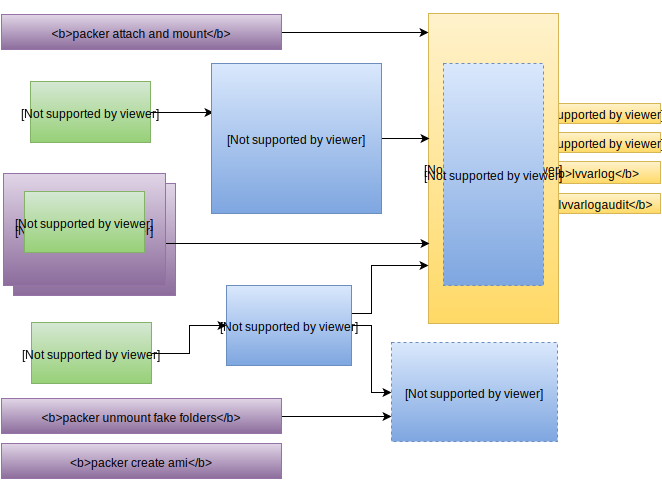

<!-- .slide: data-background="#6B205E" -->
<center><div style="width: 75%; height: auto;"></div></center>
<br />
<center>
<br />
<br />
**OS Hardening with Packer**

**Werner Buck** wbuck@xebia.com

<!-- !SLIDE -->
<!-- .slide: data-background="#6B205E" -->
<!-- # Structure

* What / Why OS Hardening?
* Implementation
* Block Storage Manipulation
* Auditing
* Conclusion -->

!SLIDE
# What is OS Hardening
The process of reducing the **vectors of attack** on the OS layer.

!NOTE

CoreOS has the right idea here, now we have to worry about 10000+ outdated images

!SLIDE
# Why OS hardening?

We are not all on PaaS yet.

Enterprise has requirements to meet for HIPAA / PCI-DSS / SOX / FISMA

Standard Linux distributions are not made for the **best** security **by default**.

Made to cater the **largest** customer base.

!NOTE
Think about docker hosts,
GRSEC, SELinux.

!SLIDE
# Lets look at some common OS defaults..

Default umask is 002. New files are **World** readable by default!

**/tmp** without **noexec** and **nosuid** !

!NOTE
Many simple exploits that are used against machines, (via vulnerable PHP applications or local users, etc), rely upon being able to execute commands in /tmp. If this is a seperate partition or file system you can gain some protection by marking it non-executable. The common problem with this is that apt-get fails to work with such a setup.

!SLIDE
But what are the best practices?

!SLIDE
# Hardening implementation Guides

Stand on the shoulders of giants

Implementation guides called **CIS** and **STIG**


Guides ranging from **Microsoft PowerPoint** to **Docker hosts**

!NOTE
CIS is a nonprofit working to increase security.
STIG was made by the Defense Information Systems Agency

!SLIDE
Docker-bench-security is inspired by CIS!

([github.com/docker/docker-bench-security](github.com/docker/docker-bench-security))

!NOTE
Docker-bench-security by Diogo Mónica

!SLIDE
#Example CIS benchmark requirements
* Force GPG checks on all your repositories
* Removal of packages: rsh-server, telnet-server, xorg-x11-server-common ...
* Disable anything you do not specifically use:
  * **xinetd** (services), **avahi** (zeroconf), **dhcp**, **nfs**
* Ensure NTP is active and properly synchronized
* Much more..

!SLIDE

CIS wants you to modify **kernel parameters**

```
net.ipv4.ip_forward = 0
net.ipv4.conf.default.send_redirects = 0
net.ipv4.conf.all.accept_source_route = 0
net.ipv4.tcp_syncookies = 1
net.ipv4.icmp_ignore_bogus_error_responses = 1
net.ipv4.icmp_echo_ignore_broadcasts = 1
net.ipv4.icmp_ignore_bogus_error_responses = 1
net.ipv4.conf.default.log_martians = 1
...
```

Do **not** implement **until** you understand the consequences

**Non-scored**, but CIS also recommends **disabling IPV6**

!SLIDE
Again.. remember we are reducing the **potential attack surface**

!SLIDE
How do we implement the guides?

!SLIDE
#Compliance as a Service?

CIS Hardened Image Red Hat 5/6/7 AMI and more

Costs **$0.02** an hour.

!SLIDE
But more importantly.. are you in control?

!NOTE
Maintenance

!SLIDE
#Execute (insert CMT) on boot?

1. Install puppet agent
2. Fetch config
3. Execute hardening!

!SLIDE
Ask yourself.. what if this process fails?

Your new machine is half-secure on your production network.

It even started out on your production network as unhardened and non-compliant

!NOTE
Someone adds cloud-init pre-command to simply "disable" the agent

!SLIDE
##We are making a base image! With packer!

!SLIDE

Use Packer's **provisioners** to apply hardening

Create AMI's that are compliant **on boot**

!SLIDE
# Ansible roles!

!SLIDE

**STIG**: Openstack's Ansible Security

[github/openstack-ansible-security](https://github.com/openstack/openstack-ansible-security/)

**STIG+CIS**: Ansible Lockdown

[github/ansible-lockdown](https://github.com/ansible/ansible-lockdown)

!SLIDE
<!-- .slide: data-background="#6B205E" -->
# This just in..

A CIS requirement is that your systems must have **different** filesystems for:

```
/var
/var/log
/var/log/audit
/home
/tmp
```

!SLIDE

**Rationale** is to prevent resource **exhaustion**.

!SLIDE
# cat /dev/zero > zerofile

Check and see how fast you can fill up your disk..

!SLIDE

Allow (audit) logging to continue during application error or attack.

!SLIDE
# Automating this requirement..

We want to use the original RHEL AMI as our source.

We do not want to reboot..

CIS recommends to implement the **Logical Volume Manager** (LVM)

!SLIDE
# Packer's amazon-chroot builder

Mounts a new volume based on source AMI **directly** on the packer host

Different from the regular provider as it does **not** require launching a machine.

!NOTE
In my experience..

!SLIDE
# shell-local provisioner

Idea: use **shell-local** provisioner to apply lvm directly on the device.

We use _lvm.sh_ to handle everything for us.

```
...
"provisioners": [
  {
    "type": "shell-local",
    "command": "{{template_dir}}/lvm.sh \"{{ user `unique_id`}}\" \"{{ user `base_path`}}_{{ user `unique_id`}}\""
  },
  ...
]
...
```

!SLIDE
# Inside lvm.sh..

Unmount and Backup the device:

```
tar -cf "${BACKUP_FILE}" --acls --selinux --xattrs --exclude='./proc/*' --exclude='./sys/*' \   
 --exclude='./dev/*' --exclude='./var/run/portreserve/socket' \   
 --exclude='./var/run/acpid.socket' --exclude='./var/run/dbus/system_bus_socket' .   
```

!SLIDE

Create logical volumes/filesystems

```
lvcreate -L5G -n lvroot "${vgname}" && /sbin/mkfs.ext4 -m0 -O ^64bit "/dev/${vgname}/lvroot"
...
```

Remount and then restore from tar

```
tar -xf "${BACKUP_FILE}" --acls --selinux --xattrs
```

!SLIDE
# Transplant is a success!

Packer continues launching provisioners as normal

Non **shell-local** provisioners use **chroot** and are not bothered.

!SLIDE
# Packer throws an error

```
...
2015/10/16 18:58:48 packer-builder-amazon-chroot:
2015/10/16 18:58:48 Removing: /mnt/packer-amazon-chroot-volumes/xvdg/etc/resolv.conf
2015/10/16 18:58:48 ui error: ==> amazon-chroot: Error unmounting device: exit status 32
==> amazon-chroot: Stderr: umount: /mnt/packer-amazon-chroot-volumes/xvdg/dev: target is busy
==> amazon-chroot:         (In some cases useful info about processes that
==> amazon-chroot:          use the device is found by lsof(8) or fuser(1).)
==> amazon-chroot:
```

!SLIDE

Not only busy, there are **more** mounts and **active** LVM volumes!

!SLIDE
# Solution

An additional script!

Deactivate the LVM volumes and mount the **fake** folders for packer solely to have them **unmounted**..

```
"provisioners": [
  {
    "type": "shell-local",
    "command": "{{template_dir}}/scripts/lvm.sh \"{{ user `unique_id`}}\" \"{{ user `base_path`}}_{{ user `unique_id`}}\""
  },
  ...
  {
    "type": "shell-local",
    "command": "{{template_dir}}/scripts/lvm.sh \"{{ user `unique_id` }}\" remount"
  }
```

Success!

!SLIDE
<center><div style="width: 75%; height: auto;"></div></center>

!SLIDE
# So.. we are not done yet

There is **no compliance** unless it can be **audited**.

!SLIDE
# Auditing

Automatically audit CIS/STIG profiles OVAL/XCCDF definition using **openscap** and the **oscap** tool.

Example scanning for vulnerabilities:
```
$ wget https://www.redhat.com/security/data/oval/Red_Hat_Enterprise_Linux_6.xml
$ oscap oval eval --results rhsa-results-oval.xml \
  --report oval-report.html Red_Hat_Enterprise_Linux_6.xml
```

Example checking for cis compliance:
```
$ oscap xccdf eval --profile selected_profile --results-arf arf.xml \
  --report report.html ssg-rhel6-ds.xml
```


!SLIDE
# Conclusion

Even hashicorp says "use **amazon-chroot** lightly".

In our case. Just use it for LVM. A run roughly takes **25** minutes to complete.

Create an AMI hierarchy and use **amazon-ebs** for the child AMI's

Reasoning:

* EBS encryption!
* LVM then only needs to be added __once__ per new RHEL image.

!NOTE
Several minutes are lost due to ansible-local has to be installed.

!SLIDE
# Should probably create a pull request..

To add an option to the **amazon-chroot** builder such as:

```
"manage_mounts": false
```

Any chance it would be accepted Mitchell?

!SLIDE
<!-- .slide: data-background="#6B205E" -->
<center>
Come by the Xebia stand for some Q/A
<br>
<br>

You can contact me at wbuck@xebia.com
<br><br>
Limited spots available for the hashicontest.io!
</center>

!SLIDE
# Mitigations for Resource Exhaustion

Following solves only disk exhaustion, some filesystmes are required to set mountoptions

* Create multiple virtual filesystems (files) and mount to apply disk quota (RHEL 6)
* If using XFS, use `xfs_quota` to set quota's per project (folder) (XFS is RHEL 7 default root)
* **LVM Logical Volume Manager** (RHEL 6)
  * Span a filesystem over multiple block devices
  * Easy resizing
  * Portability
